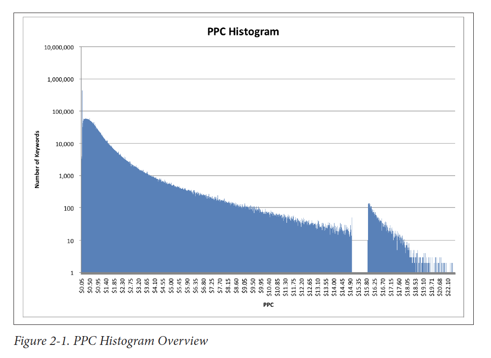

# Chapter 2: Is It Just Me, or Does This Data Smell Funny?

This chapter is about what to do when you get a dataset _without a lot of information as to where it came from_ and provides some ways to explore, validate, and gain insights from it.

It's divided into 5 sections describing ways to understand and validate your data and 4 examples.

Some of the code is a bit dated (field and value validation are much easier to accomplish using modern tools) but the ideas are still valid. 

## Understand the Data Structure
In this section, the author spends some time explaining what a some common file formats _are_ like CSV, XML, and JSON. The author also provides some **perl** code to read each of these files. 

### CSVs
Columnar files where each row is a record separated by a comma. Some times the values are enclosed by quotations (if there's a comma in the value, like `1,009.47`) and sometimes every value is enclosed by quotations. 

```shell
column_1,column_2,column_3
value 1,value 2,value 3
"an example with a commma","1,489.83","notice there are no spaces after the commas"
```

Another common character to separate values by, instead of a comma, is a tab (or `\t`) as it is uncommon to find it in the values themselves.

```shell
column_1\tcolumn_2\tcolumn_3
value 1\tvalue 2\tvalue 3
"an example with a commma"\t"1,489.83"\t"notice there are no spaces after the commas"
```
Another variation of this are fixed-width files where instead of values being separated by a character (`,` or `\t`) they are found in _sections_ of a row. For example, the first 10 characters of a row might be for column 1, the second set of 10 characters for column 2, and so on.

### XML
or eXtensible Markup Language 🙄

Looks like this
```xml
<note>
  <to>Tove</to>
  <from>Jani</from>
  <heading>Reminder</heading>
  <body>Don't forget me this weekend!</body>
</note>
```

This data format is common in some spaces (web stuff) but it's quickly becoming less and less common. Might show up when working with older systems.

Both R and Python have libraries that parse XML into dataframes so you don't have to worry too much about manually processing these files.

### JSON
or **J**ava**S**cript **O**bject **N**otation. 

This format is mostly used to move data between servers and JavaScript in web APIs but it's also not uncommon to be found in other areas. For example, there exists a variation for GIS - GeoJSON - which is a standard.

```json
{
    "key_1": "value_1",
    "name": "Not Sergio",
    "array_of_values": ["one", "two", 3],
    "nested_json": {
        "subkey_1": "subvalue_1",
        "a_number": 4,
    },
}
```

## Field Validation
This is kind of an odd problem to have. The example the author uses is that of a dataset with no column names, or a dataset that does not give you information about the fields it contains and you have to deduce units, for example. 

Another common challenge mentioned here is missing values but the author does not offer a solution or a plan of action. This is very context-specific. 

Modern tools will provide you easy access to data types once you read your data into a dataframe. After this, transforming string columns that are meant to be numeric is a simple process. For ther rest, like what to do with missing values or figuring out units, you have to rely on the context of your project.

## Value Validation

In this subsection the author spends some time explaining how he uses regular expressions to validate his data. For example, using `^\d+\.\d+\.\d+\.\d+$` to validate IP addresses that look like `127.0.0.0` or checking that a `month` column's values are in a set of values like `[0, 1, 2, ..., 12, "Jan", "Feb", ..., "Dec", "January", "February", ..., "December"]`. 

While this is one way to it, it's not really a scalable solution. Even a dataset with very few columns but millions of rows could take a long time to validate "linearly" like this. Modern data tools like R and Python use vectors to do this much more rapidly. The solution is then to figure out the right format your data _should_ be in and run some tests to check. 

A more familiar example might be FIPS codes. We know that California has the FIPS code 6 or "06" and 58 counties. A value validation check could be to look at the county FIPS code column and make sure there are no more than 58 unique values and that these values are within the range of possible values for California county FIPS codes (Alameda 001 - Yuba 115). An even more rigorous check would be to have a list of valid FIPS codes and make sure those in our dataset match those.

## Physical Interpretation of Simple Statistics

This section is about statistical validation of your numeric data. _Does your values make sense?_ This should be the first step for many people that receive a dataset with some documentation and in a readable format. 

These statistical checks are more _logical_ checks than anything. If a column contains numeric values for things in the real world - can you cross-check with other sources? The example he uses is of an item priced at $10 but when you calculate the average of your column you find out it is the number 999. This could mean the item is priced in cents in your data or that something else is going on here. Either way, you have to take a closer look at your data and document it.

Other logical checks are:
* Rates are usually 0 - 1.0 (or 0 to 100%). For example, transfer rate between community colleges and 4-year universities. The number of people transfering **have** to be less than or equal to the number of people enrolled. Anything above 100% should raise a red flag.
* Numbers that **have** to be positive (or zero). For example, population of a geographical area in a given year. You cannot have negative people living somewhere. 

Luckily, both R and python have packages that create automated reports out of datasets to do **some** of these tests for you in one go. 

For R, there is [`DataExplorer`](https://boxuancui.github.io/DataExplorer/):
> Exploratory Data Analysis (EDA) is the initial and an important phase of data analysis/predictive modeling. During this process, analysts/modelers will have a first look of the data, and thus generate relevant hypotheses and decide next steps. However, the EDA process could be a hassle at times. This R package aims to automate most of data handling and visualization, so that users could focus on studying the data and extracting insights.

For Python, there is [`pandas_profiling`](https://pandas-profiling.github.io/pandas-profiling/)

>For each column the following statistics - if relevant for the column type - are presented in an interactive HTML report:

>* **Type inference**: detect the types of columns in a dataframe.
>* **Essentials**: type, unique values, missing values
>* **Quantile statistics** like minimum value, Q1, median, Q3, maximum, range, interquartile range
>* **Descriptive statistics** like mean, mode, standard deviation, sum, median absolute deviation, coefficient of variation, kurtosis, skewness
>* **Most frequent values**
>* **Histograms**
>* **Correlations** highlighting of highly correlated variables, Spearman, Pearson and Kendall matrices
>* **Missing values** matrix, count, heatmap and dendrogram of missing values
>* **Duplicate rows** Lists the most occurring duplicate rows
>* **Text analysis** learn about categories (Uppercase, Space), scripts (Latin, Cyrillic) and blocks (ASCII) of text data

## Visualization
In his fifth suggestion the author offers data visualization. The example he uses is that of a large dataset with referral keywords (phrases on google that lead to pageviews). In his example, he creates a histogram for these keywords. This is his way to do some **_physical interpretation of simple statistics_** on non-numeric data. 

A more familiar example might be receiving a dataset from a government agency that claims to have total counts of students/patients/incarcerated people by school/clinic/prison in a specific geographic area, like a county.

A way to check that the non-numeric data (like the name of the school/clinic/prison) makes sense is to create a histogram of those names. This is very context-specific so you will rely on your subject matter expertise to check these numbers make sense. Is it supposed to be evenly distributed? Do you expect it to have 1 or 2 places that make up a large portion of the observations?

>For real datasets (i.e., ones consisting of lots of data points), a histogram provides a reasonable approximation of the distribution function and can be assessed as such. For example, you typically expect a fairly smooth function. It may be flat, or Gaussian (looks like a bell curve), or even decay exponentially (long-tail), but a discontinuity in the graph should be viewed with suspicion: it may indicate some kind of problem with the data.



## Examples

The author then goes on to provide 4 examples: Keyword PPC (pay-per-click), Search Referral, Recommendation Analysis, Time Series Data.

In these examples, he goes through some of his checks and eventually creates a chart he can then visually use to point him in the right direction for further analysis.

## Conclusion

> Data seldom arrives neatly packaged with a quality guarantee. In fact, it often arrives with little or no documentation of where it came from, how it was gathered, or what to watch out for when using it. However, some relatively simple analysis techniques can provide a lot of insight into a dataset. This analysis will often provide interesting insights into an area of interest. At the minimum, these “sniff tests” provide areas to explore or watch out for.

I have not have that be the case in my experience (_data arriving with little or no documentation of where it came from, how it was gathered, or what to watch out for when using it_) but the conclusion is the same. Exploratory data analysis is the very first step when diving into a new dataset. Coming up with a set of field and value validation checks to preliminary test your data is the best way to avoid surprises down the road.


| [Previous chapter](01-what-is-bad-data) | Next chapter |
|:------------------------------------------:|:---------------------------:|
| | |