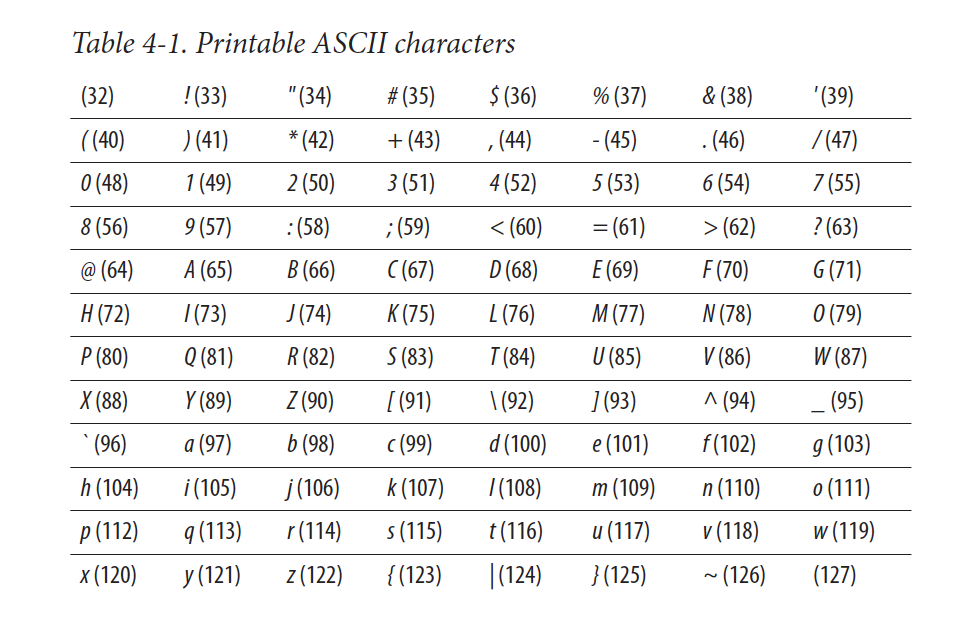

# Chapter 4: Bad Data Lurking in Plain Text

The theme of this chapter is: _What if the data format is ok but the data inside is not?_ As in, what if you double-click a CSV file and it does open but it's a bunch of garbage.

Three things it covers:
1. Unknown character encoding
2. Misrepresented character encoding
3. Application-specific characters leaking into plain text

And he shares code snippets in python 2.7 (not supported anymore).

> A text encoding is the mapping between the characters that can occur in a plain text file and the numbers computers use to represent them. A program that joins data from multiple sources may misbehave if its inputs were written using different text encodings.

There are multiple text encodings in use today and while modern tools have gotten pretty good at automatically handling that you might still face issues in your data work. 

He talks a little on the history of text encoding and why we have multiple encodings today, which may help understand why it is an issue.

The very first "modern" computers used ASCII which is a 7-bit encoding. A **bit** is the smallest unit in computers (binary notation) it's either 0 or 1. A _byte_ is 8 bits. 7 bits means the ***max*** number of options you have is 127 because 7 bits is 1111111 or 2^7.

In binary each space represents 2^(place of that space in the sequence minus one because it starts at 0)

So 111 = 1*(2^2) + 1*(2^1) + 1*(2^0) or 4 + 2 + 1 which is 7. This is the MAX of 3 bits. To represent the next number (7 + 1 = 8) you would need 4 bits, at least.

1000 would then be 8 because 1*(2^3) + 0*(2^2) + 0*(2^1) + 0*(2^0) or 8 + 0 + 0 + 0.

So 7 bits means 1 less than 8 bits and 2^8 = 128, so 127 options.

This included only the following characters:



So, to make _space_ for other characters people came up with other "tables" of characters. By people, I mean coporations making computers so IBM and Microsoft created their own "Code Pages" which meant that in some computers some symbols like € were different "numbers" which meant if you opened that same text file in another computer, it looked different. What's even worse, sometimes you have special _control_ characters that mean "new line" or "ignore the next character" like the `\n` character which is encodes as SOME number in one encoding and maybe it's encoded as another number in another. Again, this was in the 80s and 90s. Now we have unicode and that's mostly standard across all devices.

He goes on to write some python code that helps you detect character encoding for a piece of text but now there are packages you can just install if you need to do it programatically:

* `chardet` (Python): https://pypi.org/project/chardet/
* `uchardet` (R): https://www.rdocumentation.org/packages/uchardet/versions/1.1.0

## Normalizing text
The main idea on this section is that you should always use (Unicode) UTF-8 (default in most modern tools) or UTF-16 even if you read some text encoded in some other way. 


## Application-specific Characters Leaking into Plain Text
Sometimes when you work with data from the web you might find _bad_ data, URLs might still be encoded and you find a lot of `%20` in them, that's because in URLs you cannot have certain characters like spaces. If you create a link that has a space your server converts it to the ASCII character for space which is `20` (in that table) and adds a `%` to let other computers know that the following character is encoded.

The same thing happens in some HTML pages when you scrape them. In his example, you could have something like
```HTML
<script> Do something </script>
```
that comes out as `&lt;script&gt;//Do something&lt;/script&gt;`

HOWEVER, modern web scrapers in both python and R include _HTML parsers_ so all it takes is an extra step - "decode the webpage i just scraped" which is usually included in the tutorials for said web scrapers.

## Main takeaway
The main takeaway is to that we should be aware that there are different encodings out there and that they _may_ cause problems. However, modern tools have been developed to handle this so even if you do find yourself in a situation where you have some text files you cannot read at first, it just takes installing the right package to solve the problem.